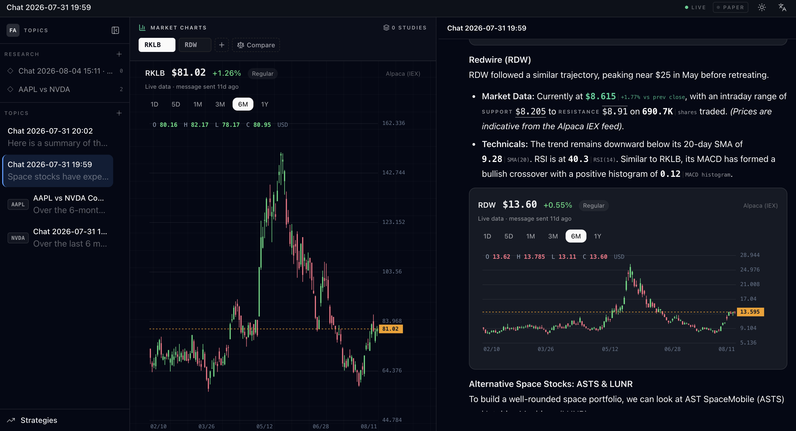
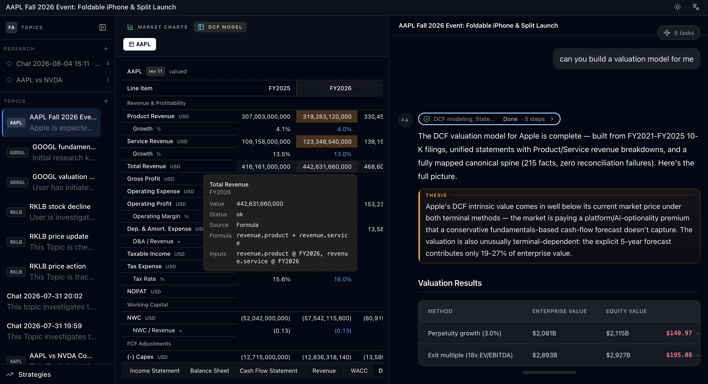
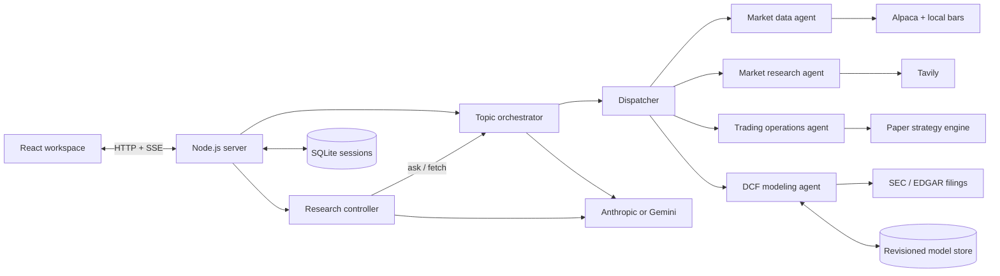

# Financial Agent

_A local-first multi-agent workspace for financial research, auditable DCF valuation, and paper strategies._


> [!IMPORTANT]
> Financial Agent is an experimental alpha. It is designed for research, valuation analysis, and paper/shadow strategy evaluation—not live brokerage execution or personalized financial advice.

📖 [Design Philosophy](docs/article/philosophy.md)

Financial Agent turns isolated AI chats into durable financial workspaces. It combines three connected loops: research a company or macro question, build a filing-grounded intrinsic-value model when valuation is needed, and evaluate a paper strategy when an investment thesis becomes a rule. A **Topic** keeps the conversation, charts, evidence, and model activity for one company or question. A **Research** workspace brings several Topics together so a controller agent can compare their evidence and valuation conclusions without erasing their independent histories.

The result is not merely a chat summary: a DCF request can create a revisioned workbook whose historical facts trace to filings and whose forecast, WACC, terminal-value, and equity-bridge choices remain inspectable after the agent finishes.



## Highlights

- **Durable research units** — Topics persist their conversation and user-owned chart tabs in local SQLite.
- **Cross-topic synthesis** — Research workspaces coordinate multiple Topics while keeping source work in the Topic where it belongs.
- **Specialized agent routing** — the orchestrator delegates market data, current research, DCF modeling, and trading operations to focused subagents.
- **Live US market context** — Alpaca-backed quotes and candles for US stocks and ETFs, plus SMA, EMA, RSI, MACD, Bollinger Bands, ATR, OBV, VWAP, and support/resistance tools.
- **Source-aware research** — Tavily search results flow through the agent and into citation-capable answers.
- **Agent-authored DCFs** — turn SEC filings into a revisioned, auditable discounted-cash-flow model with historical mapping, forecast formulas, WACC, terminal value, equity bridge, and sensitivities.
- **Paper strategy workflows** — create, approve, monitor, pause, resume, and cancel price- or indicator-driven paper/shadow strategies.
- **Streaming workspace UI** — React 19, SSE progress, resizable panes, dark/light themes, and English/Chinese localization.



_An end-to-end AAPL DCF workspace. The open tooltip is the point: every cell says where it came from — here `Total Revenue FY2026` is a formula over `revenue.product + revenue.service`, with the exact inputs it read. On the right, the agent's own conclusion, including that its intrinsic value lands well below the market price and why._

## Core concepts

| Concept | Purpose |
| --- | --- |
| **Topic** | A durable thread for one company, asset, or macro question. It holds conversation, charts, source research, and any DCF-modeling work started for that subject. |
| **Research** | A comparison workspace that coordinates several Topics and synthesizes their research and valuation conclusions without merging their histories. |
| **DCF model** | A revisioned intrinsic-value workbook owned by the financial-modeling agent, with lineage from filing facts through historical formulas, forecasts, WACC, terminal value, equity bridge, and per-share outputs. |
| **Strategy** | A locally monitored, approval-gated paper or shadow workflow that can operationalize a research or valuation thesis through price or technical-indicator conditions. |

Each Topic is a long-lived financial workstream with its own conversation and chart workspace. The agent can attach live charts and technical studies, use cited external research, or construct a DCF from SEC filings; the user keeps control of the visible tabs and layout.

## How it works



The Research controller sits beside the normal Topic orchestrator. When it asks a Topic to investigate or value a company, that work runs through the same agent path as a direct user message and is persisted in that Topic's history. Research keeps the comparison and synthesis layer, while the filing evidence and DCF revisions remain owned by the relevant Topic/model.

### From question to decision support

| Ask | System path | Durable output |
| --- | --- | --- |
| “What changed in AAPL’s Services business?” | Topic research → market/research tools | Cited research and charts in the Topic |
| “Build a DCF for AAPL from its SEC filings.” | `financial_modeling` → extraction → mapping → forecast → valuation | Revisioned DCF workbook, source review, assumptions, and sensitivity tables |
| “Compare the valuation cases for AAPL and MSFT.” | Research controller → the corresponding Topics/models | Cross-topic synthesis while each model keeps its own lineage |
| “Alert me when the thesis condition is met.” | Trading operations → paper/shadow strategy engine | Approval-gated, locally monitored paper strategy |

## DCF valuation workflow

Ask for an intrinsic value, fair value, or DCF for a specific company—for example, “Build a DCF for AAPL from its SEC filings.” The orchestrator routes this work to the dedicated `financial_modeling` agent. A full DCF can span multiple agent rounds; the same thread is resumed until the model reaches a terminal lifecycle state.

The DCF agent owns the modeling judgments and model revisions. It takes a company from SEC filings through historical financials, forecast, WACC, terminal-value methods, equity bridge, and sensitivities. The surrounding application streams progress to the workspace and persists the evidence and model trail, so the user can review a durable valuation artifact rather than trust a final prose answer.

```mermaid
flowchart LR
    P[User valuation request] --> A[financial_modeling]
    A --> E[Extract SEC / EDGAR statements]
    E --> U[Unify multi-year statements]
    U --> M[Map issuer lines to DCF spine]
    M --> H[Historical facts and formulas]
    H --> F[Forecast drivers and FCFF]
    F --> W[WACC, terminal value, equity bridge]
    W --> V[Revisioned valued model + sensitivities]
```



### Model behavior and auditability

- **Source-free skeletons** — the workbook starts with semantic rows only. It does not predeclare historical/forecast source types or seed formulas. A row becomes an actual, formula, or assumption only when evidence is written to it.
- **Agent-owned judgment** — directly disclosed values are mapped from filings; derived values (such as bridge cash made from cash plus short-term investments) are authored as explicit formulas; forecast inputs are recorded as assumptions with rationale and source references.
- **Explainable progress** — lifecycle blockers identify the exact incomplete cell and failed requirement, rather than reporting only a broad stalled stage.
- **Revision-aware context** — mutations report a compact change summary. Previously read workbook slices remain available as clearly marked historical context, and the agent decides when it needs a current reread.
- **Traceable outputs** — model revisions, formulas, assumptions, source review, tool calls, and final workbook snapshots are persisted locally.

### Run the full DCF E2E test

The end-to-end test starts from an empty model and uses a live LLM provider plus SEC/EDGAR access. It does not pre-populate statement mappings, formulas, or valuation assumptions: the agent must build the model and the calculation engine must validate it before the run passes.

```bash
node --env-file=.env --experimental-strip-types --experimental-sqlite \
  scripts/xbrl/e2e_test/dcf-agent-e2e.ts AAPL --fresh
```

`--fresh` recreates only the output directory for that symbol under `data/e2e-test/dcf-agent/`. A run writes audit artifacts as it progresses, so an interrupted run remains inspectable and a passed run is reproducibly reviewable:

| Artifact | Contents |
| --- | --- |
| `summary.json` | Verdict, lifecycle, valuation outputs, and sensitivities |
| `run-config.json` | Symbol, provider, prompt, paths, and round limits |
| `events.jsonl`, `notes.jsonl`, `steps/` | Event stream, agent reasoning notes, and every completed tool call |
| `rounds/` | Per-dispatch task result and lifecycle/revision after each round |
| `model/revisions.json` | Revision headers and compact change summaries |
| `model/final-snapshot.json` | Final persisted workbook, including cells and calculations |
| `model/source-review.json` | Filing extraction, unified statements, mapping, and coverage review |

Useful environment overrides include `E2E_SYMBOL`, `E2E_AGENT_OUTPUT_DIR`, `E2E_MAX_ROUNDS`, and `E2E_ROUND_TIMEOUT_MIN`. To resume an existing model in a clean agent session, set both `E2E_MODEL_DB_PATH` and `E2E_RESUME_MODEL_ID`.

The latest full-chain AAPL validation reached `valued` from a blank model in one round of 46 agent steps; its [detailed E2E report](docs/2026-08-19-aapl-dcf-full-e2e-report.md) includes the exact assumptions, delegation and playbook accounting, prompt-cost table, outputs, and caveats — including the one methodological fault the run exposed. A successful run validates the engineering workflow, not the economic correctness of its assumptions or an investment recommendation.

## Technology

| Layer | Stack |
| --- | --- |
| Workspace UI | React 19, Vite 6, Tailwind CSS, TanStack Query, Chart.js |
| Server | Node.js 23, TypeScript, HTTP, Server-Sent Events |
| Agent runtime | Model routing, specialized subagents, MCP-style local tools, context compaction, and revision-aware DCF modeling |
| Models | Anthropic Claude, Google Gemini through AI Studio or Vertex AI |
| Data | SQLite, Alpaca market data, Tavily web search |

## Quick start

### Prerequisites

- Node.js 23 or newer
- pnpm 10.x
- One supported LLM provider for meaningful responses and DCF authoring: Anthropic, Google AI Studio, or Google Vertex AI
- Optional: Tavily for current web research and Alpaca for US stock quotes/charts
- SEC/EDGAR network access for filing-grounded DCF extraction and the full DCF E2E test

### Install and configure

```bash
git clone https://github.com/Ocisly14/financial_agent.git
cd financial_agent

pnpm install
pnpm --prefix client install

cp .env.example .env
```

Edit `.env` and configure one LLM path. The smallest Anthropic setup is:

```dotenv
LLM_PROVIDER=anthropic
ANTHROPIC_API_KEY=your_key_here
```

Google AI Studio uses `LLM_PROVIDER=google` with `GOOGLE_GENERATIVE_AI_API_KEY`; Vertex AI uses `LLM_PROVIDER=vertex` with the project, location, and service-account JSON settings documented in `.env.example`.

If no provider is configured, the server falls back to a deterministic mock provider. That is useful for checking the interface, but it does not produce real research or author a DCF model.

### Run in development

Start the backend:

```bash
pnpm dev
```

In a second terminal, start the Vite client:

```bash
pnpm start:client
```

Open [http://localhost:5173](http://localhost:5173). The API and health endpoint run at [http://localhost:3000](http://localhost:3000) and [http://localhost:3000/health](http://localhost:3000/health).

### Run the production build locally

```bash
pnpm build:client
pnpm start
```

The Node server serves the built client at [http://localhost:3000](http://localhost:3000).

## Configuration

| Capability | Variables | Required? |
| --- | --- | --- |
| Anthropic | `LLM_PROVIDER=anthropic`, `ANTHROPIC_API_KEY` | Choose one LLM path |
| DeepSeek | `LLM_PROVIDER=deepseek`, `DEEPSEEK_API_KEY` | Choose one LLM path |
| Google AI Studio | `LLM_PROVIDER=google`, `GOOGLE_GENERATIVE_AI_API_KEY` | Choose one LLM path |
| Google Vertex AI | `LLM_PROVIDER=vertex`, `GOOGLE_VERTEX_PROJECT`, `GOOGLE_APPLICATION_CREDENTIALS_JSON` | Choose one LLM path |
| Current web research | `TAVILY_API_KEY` and optional rotation keys | Optional |
| US stock data | `ALPACA_API_KEY_ID`, `ALPACA_API_SECRET_KEY` | Optional, required for live charts |
| DCF filing extraction | Network access to SEC/EDGAR | Required only to build filing-grounded DCFs |
| Local persistence | `SESSION_DB_PATH`, `STOCK_DB_PATH`, `FINANCIAL_MODEL_DB_PATH` | Optional; defaults live under `data/` |
| Server | `SERVER_PORT`, `SERVER_BASE_URL`, `SSE_KEEPALIVE_INTERVAL` | Optional |

Each provider maps the `SMALL`, `MEDIUM`, and `LARGE` model classes to its own built-in defaults. Override a class with `<PROVIDER>_MODEL_<CLASS>` — `ANTHROPIC_MODEL_MEDIUM`, `DEEPSEEK_MODEL_LARGE`, `GOOGLE_MODEL_SMALL`, `VERTEX_MODEL_LARGE`. The overrides are namespaced per provider so that switching `LLM_PROVIDER` never hands the new provider another vendor's model IDs; Vertex additionally falls back to `GOOGLE_MODEL_*`.

## Development

| Command | Purpose |
| --- | --- |
| `pnpm dev` | Start the backend with TypeScript stripping and file watching |
| `pnpm start:client` | Start the Vite development client |
| `pnpm build` | Type-check the backend and tools |
| `pnpm build:client` | Install client dependencies, then type-check and build the client |
| `pnpm test` | Run backend, data, agent, server, and client library tests |
| `pnpm tools:list` | List registered local MCP-style tools |
| `pnpm eval` | Run the agent evaluation suite |
| `node --env-file=.env --experimental-strip-types --experimental-sqlite scripts/xbrl/e2e_test/dcf-agent-e2e.ts AAPL --fresh` | Run a blank-to-valued, filing-grounded DCF E2E capability test |

```text
client/       React workspace, charts, routes, and localization
mcp_tools/    Market data, research, technical, strategy, and financial-model tools
src/agent/    Orchestrator, subagents, prompts, and Research runtime
src/framework Agent runtime, events, dispatch, skills, and compaction
src/data/     Alpaca-backed stock data and local bar storage
src/financial-model/ Revisioned DCF workbook, calculation engine, views, and persistence
src/trading/  Paper strategy workflows, monitoring, and persistence
src/server/   HTTP, SSE, workspace, market, and strategy routes
scripts/eval/ Evaluation datasets, replay, metrics, and reports
scripts/xbrl/e2e_test/ Blank-to-valued DCF agent end-to-end capability tests and artifacts
```

Design notes and implementation specs live in [`docs/`](docs/).

## Current limitations

- The app is local-first and has no authentication or multi-user authorization layer.
- Market-data and strategy tooling currently targets US stocks and ETFs.
- Strategy execution is paper/shadow only; live mode is rejected because no broker adapter is installed.
- DCF outputs are research artifacts, not investment advice. A passed E2E run proves the workflow completed; it does not validate economic assumptions, filing interpretation, current market inputs, or a buy/sell decision.
- Real research and market features depend on external provider availability, quotas, and data freshness.
- APIs, persistence schemas, and workspace behavior may change during the alpha.

Financial Agent is a research and engineering project. Verify important information independently before making financial decisions.
