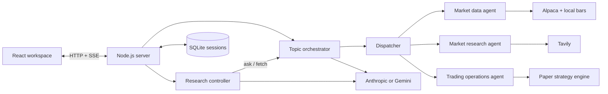

# Financial Agent

_A local-first multi-agent workspace for financial research and paper strategies._


> [!IMPORTANT]
> Financial Agent is an experimental alpha. It is designed for research and paper/shadow strategy evaluation—not live brokerage execution or personalized financial advice.

Financial Agent turns isolated AI chats into durable research workspaces. A **Topic** keeps the conversation, charts, and evidence for one company or macro question. A **Research** workspace brings several Topics together so a controller agent can compare them, ask each one for more work, and synthesize the result without erasing their independent histories.


## Highlights

- **Durable research units** — Topics persist their conversation and user-owned chart tabs in local SQLite.
- **Cross-topic synthesis** — Research workspaces coordinate multiple Topics while keeping source work in the Topic where it belongs.
- **Specialized agent routing** — the orchestrator delegates market data, current research, and trading operations to focused subagents.
- **Live US market context** — Alpaca-backed quotes and candles for US stocks and ETFs, plus SMA, EMA, RSI, MACD, Bollinger Bands, ATR, OBV, VWAP, and support/resistance tools.
- **Source-aware research** — Tavily search results flow through the agent and into citation-capable answers.
- **Paper strategy workflows** — create, approve, monitor, pause, resume, and cancel price- or indicator-driven paper/shadow strategies.
- **Streaming workspace UI** — React 19, SSE progress, resizable panes, dark/light themes, and English/Chinese localization.

## Core concepts

| Concept | Purpose |
| --- | --- |
| **Topic** | A durable thread for researching one company, asset, or macro question, with its own conversation and chart layout. |
| **Research** | A comparison workspace that coordinates several Topics and synthesizes their findings without merging their histories. |
| **Strategy** | A locally monitored, approval-gated paper or shadow workflow driven by price or technical-indicator conditions. |

Each Topic is a long-lived research thread with its own conversation and chart workspace. The agent can attach live charts and technical studies, while the user keeps control of the visible tabs and layout.


## How it works



The Research controller sits beside the normal Topic orchestrator. When it asks a Topic to investigate something, that work runs through the same agent path as a direct user message and is persisted in that Topic's history. Research keeps only the comparison and synthesis layer.

## Technology

| Layer | Stack |
| --- | --- |
| Workspace UI | React 19, Vite 6, Tailwind CSS, TanStack Query, Chart.js |
| Server | Node.js 23, TypeScript, HTTP, Server-Sent Events |
| Agent runtime | Model routing, specialized subagents, MCP-style local tools, context compaction |
| Models | Anthropic Claude, Google Gemini through AI Studio or Vertex AI |
| Data | SQLite, Alpaca market data, Tavily web search |

## Quick start

### Prerequisites

- Node.js 23 or newer
- pnpm 10.x
- One supported LLM provider for meaningful responses: Anthropic, Google AI Studio, or Google Vertex AI
- Optional: Tavily for current web research and Alpaca for US stock quotes/charts

### Install and configure

```bash
git clone https://github.com/Ocisly14/financial_agent.git
cd financial_agent

pnpm install
pnpm --prefix client install

cp .env.example .env
```

Edit `.env` and configure one LLM path. The smallest Anthropic setup is:

```dotenv
LLM_PROVIDER=anthropic
ANTHROPIC_API_KEY=your_key_here
```

Google AI Studio uses `LLM_PROVIDER=google` with `GOOGLE_GENERATIVE_AI_API_KEY`; Vertex AI uses `LLM_PROVIDER=vertex` with the project, location, and service-account JSON settings documented in `.env.example`.

If no provider is configured, the server falls back to a deterministic mock provider. That is useful for checking the interface, but it does not produce real research.

### Run in development

Start the backend:

```bash
pnpm dev
```

In a second terminal, start the Vite client:

```bash
pnpm start:client
```

Open [http://localhost:5173](http://localhost:5173). The API and health endpoint run at [http://localhost:3000](http://localhost:3000) and [http://localhost:3000/health](http://localhost:3000/health).

### Run the production build locally

```bash
pnpm build:client
pnpm start
```

The Node server serves the built client at [http://localhost:3000](http://localhost:3000).

## Configuration

| Capability | Variables | Required? |
| --- | --- | --- |
| Anthropic | `LLM_PROVIDER=anthropic`, `ANTHROPIC_API_KEY` | Choose one LLM path |
| Google AI Studio | `LLM_PROVIDER=google`, `GOOGLE_GENERATIVE_AI_API_KEY` | Choose one LLM path |
| Google Vertex AI | `LLM_PROVIDER=vertex`, `GOOGLE_VERTEX_PROJECT`, `GOOGLE_APPLICATION_CREDENTIALS_JSON` | Choose one LLM path |
| Current web research | `TAVILY_API_KEY` and optional rotation keys | Optional |
| US stock data | `ALPACA_API_KEY_ID`, `ALPACA_API_SECRET_KEY` | Optional, required for live charts |
| Local persistence | `SESSION_DB_PATH`, `STOCK_DB_PATH` | Optional; defaults live under `data/` |
| Server | `SERVER_PORT`, `SERVER_BASE_URL`, `SSE_KEEPALIVE_INTERVAL` | Optional |

`LLM_MODEL_SMALL`, `LLM_MODEL_MEDIUM`, and `LLM_MODEL_LARGE` override the built-in model mapping. Only set them to model IDs supported by the selected provider.

## Development

| Command | Purpose |
| --- | --- |
| `pnpm dev` | Start the backend with TypeScript stripping and file watching |
| `pnpm start:client` | Start the Vite development client |
| `pnpm build` | Type-check the backend and tools |
| `pnpm build:client` | Install client dependencies, then type-check and build the client |
| `pnpm test` | Run backend, data, agent, server, and client library tests |
| `pnpm tools:list` | List registered local MCP-style tools |
| `pnpm eval` | Run the agent evaluation suite |

```text
client/       React workspace, charts, routes, and localization
mcp_tools/    Market data, research, technical, and strategy tools
src/agent/    Orchestrator, subagents, prompts, and Research runtime
src/framework Agent runtime, events, dispatch, skills, and compaction
src/data/     Alpaca-backed stock data and local bar storage
src/trading/  Paper strategy workflows, monitoring, and persistence
src/server/   HTTP, SSE, workspace, market, and strategy routes
scripts/eval/ Evaluation datasets, replay, metrics, and reports
```

Design notes and implementation specs live in [`docs/`](docs/).

## Current limitations

- The app is local-first and has no authentication or multi-user authorization layer.
- Market-data and strategy tooling currently targets US stocks and ETFs.
- Strategy execution is paper/shadow only; live mode is rejected because no broker adapter is installed.
- Real research and market features depend on external provider availability, quotas, and data freshness.
- APIs, persistence schemas, and workspace behavior may change during the alpha.

Financial Agent is a research and engineering project. Verify important information independently before making financial decisions.
